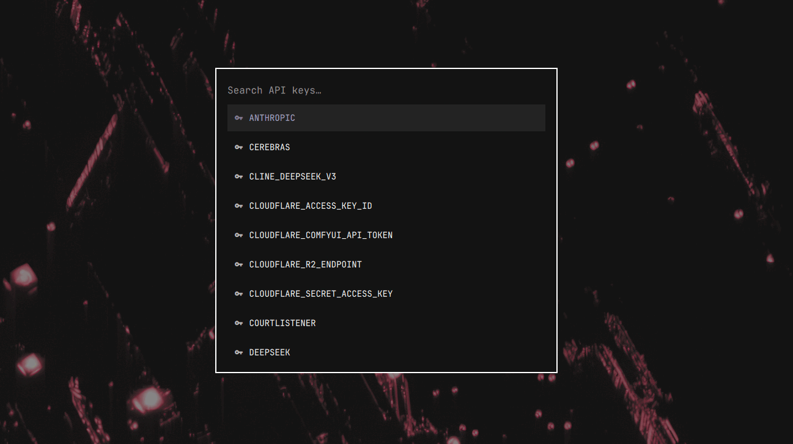

# omakeys

<p align="center">
  
</p>

A clipboard-history-style API key selector for [Omarchy](https://omarchy.org).
Press **Super + A**, type to filter your key names, hit Enter — the key is on
your clipboard. Keys are stored encrypted in gnome-keyring, never in plaintext
files, and copies are marked sensitive so they stay out of Omarchy's clipboard
history.

Built as a native Omarchy shell (Quickshell) overlay, modeled on the stock
clipboard manager — same look, same theming, same type-to-filter feel.

## Install

```bash
git clone https://github.com/chrispository/omakeys.git
cd omakeys
./install
```

The installer copies the plugin into `~/.config/omarchy/plugins/`, installs
the `omakeys` CLI to `~/.local/bin/`, enables the plugin, and binds
**Super + A** (skipped with instructions if you already have that key bound).

Dependencies (`libsecret`, `wl-clipboard`, `wtype`) ship with Omarchy by
default; the installer adds any that are missing via `omarchy pkg add`.

## Changing the keybinding

The install script adds this line to `~/.config/hypr/bindings.lua`:

```lua
o.bind("SUPER + A", "OmaKeys", "omarchy-shell shell toggle chrispository.omakeys")
```

To rebind it, edit that line — change `"SUPER + A"` to whatever chord you
want, e.g. `"SUPER + SHIFT + K"`. Check for conflicts first:

```bash
omarchy menu keybindings --print | grep -i 'SUPER + SHIFT + K'
```

If it's already bound to something else, unbind it first by adding a line
above your new binding:

```lua
hl.unbind("SUPER + SHIFT + K")
o.bind("SUPER + SHIFT + K", "OmaKeys", "omarchy-shell shell toggle chrispository.omakeys")
```

Hyprland auto-reloads on save; run `hyprctl reload` and `hyprctl configerrors`
to confirm it applied cleanly. The `chrispository.omakeys` name is fixed —
that's the plugin's id, not part of the shortcut — so only the key chord in
`o.bind(...)` needs to change.

## Use

### The CLI

```bash
omakeys add <name>       # store a key (hidden prompt, or pipe the value in)
omakeys list             # list key names
omakeys copy <name>      # copy to clipboard
omakeys show <name>      # print to stdout
omakeys rm <name>        # delete
omakeys mv <old> <new>   # rename (prompts before overwriting an existing name)
omakeys import <file>    # bulk import, then offers to shred the file
```

### Bulk import

One key per line, either `NAME=VALUE` or `NAME<whitespace>VALUE`
(blank lines and `#` comments are skipped):

```
openai=sk-abc123...
anthropic	sk-ant-xyz...
```

```bash
omakeys import ./mykeys.txt
```

After a successful import it offers to `shred -u` the file, since it holds
plaintext keys. Never paste key values into AI chats or other remote services
— keep the import file local.

## How it works

- Keys live in the gnome-keyring login collection as generic secrets with
  attributes `service=api-keys`, `name=<key name>`. Encrypted at rest,
  unlocked automatically with your login.
- The overlay enumerates names via `secret-tool search` (names only —
  secret values are never loaded into the shell process).
- Copying pipes `secret-tool lookup` straight into
  `wl-copy --trim-newline --sensitive`, so the value never touches a file,
  an argv, or the clipboard history.

### Threat model, honestly

The keyring is unlocked for your whole session: this protects keys on a
stolen or backed-up disk, not from malware already running as your user.
If you want a passphrase prompt on every use, you want `pass` with GPG
pinentry instead of this tool.

## Uninstall

```bash
./uninstall
```

Removes the plugin, CLI, and keybinding. Stored keys are left in the keyring
(the script prints a one-liner to wipe them if you want that too).

## License

MIT — see [LICENSE](LICENSE).
